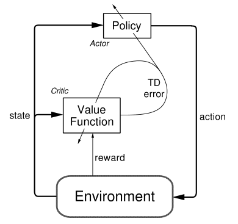
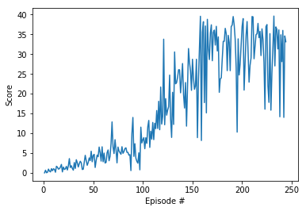
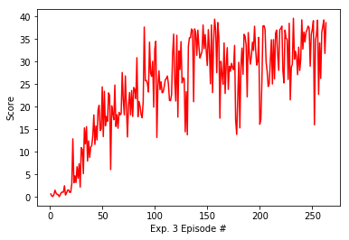
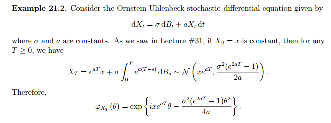

### Definition of Problem 
Please see the `Readme.md` session

### Method 
In this project, I used Deep Determinstic Policy Gradient (DDPG) for a off-policy and model-free actor-critic algorithms. DDPG expand the Deep-Q-Network(DQN)'s accessibility on learning determinstic policy on contious place.     

### Neural networks

The actor-network directly outputs action which agent will take and use without any additional clipping, normalizing or preprocessing. The neural network gives an output related to its action space(=4). The hidden size parameters were chosen after careful tuning. I did experiments with 128 nodes and 256 nodes. The network with 256 has better learning performance among the first 100 episodes, but this advantage was slightly fading when the episode approach to 300 episodes. In general, the model with 256 hidden layers has a better performance with 32.1 % improvement on average-reward-scores. 

##### Figure 1. (a) DDPG with 128 hidden layers (solved in 244 episodes) (b) DDPG with 256 hidden layers (solved in 203 episodes)

#### Denosie during the exploration 

I used ornstein uhlenbeck process during the learning processing in the continuous space. 

#### Actor network

- 3 fully connected layers
- 33 input nodes [observation vector size], 4 output nodes [action vector size], 512 hidden nodes in each layer

#### Critic network

- 3 fully connected layers
- 33 input nodes [observation vector size], 1 output nodes, 256 hidden nodes in each layer

### Future Works

- **Proximal Policy Optimization** -  This objective implements a way to do a Trust Region update which is compatible with Stochastic Gradient Descent, and simplifies the algorithm by removing the KL penalty and need to make adaptive updates. 

- **Hyperparameter** - I focused on tuning hidden size and gradient clip which gave major improvements. A larger size could be discussed and further to be implements. 
